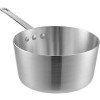
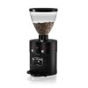
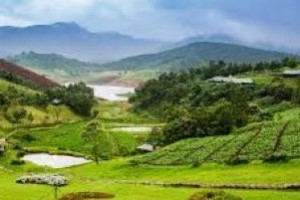
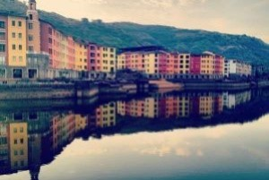
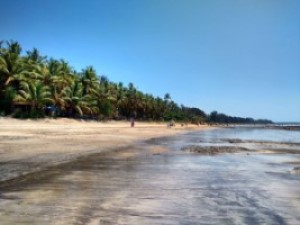
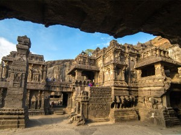

# assignment2-jarugula
An assignment on markdown
# My name is Venkat Sai Jarugula
###### My favorite food is Chicken Biryani which is an Indian dish.

Chicken Biryani is cooked with **long grained flavored rice** called Basmati and pieces of **fried chicken** which is delicious to eat. And it is **served with thick gravy and yogurt**. Because of its aroma of flavored rice and nicely cooked meat, biryani is my favorite and I always love to eat it on special occasions. And my city that I come from is very famous for biryani called **Hyderabadi Biryani**.
***
# Instructions to make coffee
1. Before making coffee we need to grind the coffee beans to powder, following below steps:
   1. Take the coffee beans into the cup of the coffee grinder.
   2. Just one scoop is enough for one cup of coffee, increase the number of beans if you wish to make more cups.
   3. Grind the coffee beans to fine powder 
   4. Store the coffee powder in a tight container. So that, it won't lose the aroma
2. Take a vessel and boil the milk.
3. Take a Coffee mug and add coffee powder, according to your preference
4. Now pour the hot milk into coffee mug and stir it with a spoon
5. Now add sugar according to your taste and enjoy the hot coffee.


### Ingredients needed to make coffee
* Milk <br>
* Coffee Beans  <br>
* Sugar <br>
* A vessel to boil milk <br>
* Coffee grinder to grind the beans <br>
* Coffee Mug <br> 

[***Click here to know about me***](AboutMe.md)

***
# Places that I would recommend someone to visit

Below are the list of places I have visited in India and the places I would like to recommend to others who want to visit India. And I have also added number of hours a visitor should spend in the location and the expected pay.

| Location | Number of hours <br> that a visitor <br> should spend |Amount of money<br> someone should <br> expect to pay | pictures of location |
| :---: | :---: | :---: | :---: |
| Ooty | 48hrs| $500 ||
| Lonavla | 10hrs | $150 | |
| Lavasa | 5hrs | $100||
| Alibag Beach | 8hrs | $300 ||
| Ellora Caves | 4hrs| $200 ||

***
# My favorite quotes 
>"All power is within you; you can do anything and everything. Believe in that, do not believe that you are weak; do not believe that you are half-crazy lunatics, as most of us do nowadays. You can do any thing and everything, without even the guidance of any one. Stand up and express the divinity within you."<br>
*- Swami Vivekananda*<br>

>"If you want to shine like a sun, first burn like a sun."<br>
*- APJ Abdul Kalam*

***
# MATLAB

>MATLAB (an abbreviation of "matrix laboratory") is a proprietary multi-paradigm programming language and numeric computing environment developed by MathWorks. MATLAB allows matrix manipulations, plotting of functions and data, implementation of algorithms, creation of user interfaces, and interfacing with programs written in other languages.

***Click on the link to navigate to the source page*** <https://en.wikipedia.org/wiki/MATLAB>
### Below is the sample code
```
classdef Hello
    methods
        function greet(obj)
            disp('Hello!')
        end
    end
end

```
***Click on the link to navigate to the code source page*** <https://en.wikipedia.org/wiki/MATLAB#Classes_and_object-oriented_programming>


